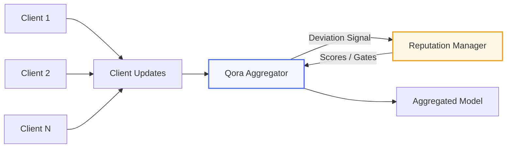

# Qora-FL

**Quorum-Oriented Robust Aggregation for Federated Learning**

[](https://crates.io/crates/qora-fl)
[](https://pypi.org/project/qora-fl/)
[](https://doi.org/10.5281/zenodo.18513738)
[](LICENSE-MIT)

## Problem

Federated learning systems are fragile under adversarial or faulty clients.
Standard aggregation methods silently fail under model poisoning, gradient manipulation, or non-IID drift.

Qora-FL provides quorum-oriented, Byzantine-tolerant aggregation primitives designed for predictable behavior under adversarial conditions, with optional determinism and reputation-aware filtering. Replace FedAvg with a single line change and tolerate up to 30% malicious clients.

## How Qora-FL Differs

Most "robust FL" implementations are paper artifacts or tightly coupled experiments.
Qora-FL is designed as **infrastructure**, emphasizing:

- **Explicit aggregation semantics** -- each method has documented tolerance bounds, not just "robust"
- **Measurable deviation signals** -- reputation is derived from observable behavior, not assumed trust
- **Deterministic execution paths** -- Q16.16 fixed-point option for bit-perfect reproducibility
- **Ecosystem integration** -- drop-in Flower strategy, not a standalone experiment
- **Benchmarked overhead** -- sub-10ms aggregation for 100K parameters, not just accuracy claims

| Feature | FedAvg | Typical Robust FL | Qora-FL |
|---------|--------|-------------------|---------|
| Byzantine tolerance | -- | Paper-only | Validated (181-day deployment) |
| Deterministic option | -- | -- | Q16.16 fixed-point |
| Reputation tracking | -- | -- | Deviation-derived, persistent |
| Flower integration | Native | -- | Drop-in `QoraStrategy` |
| Benchmarked overhead | -- | -- | <10ms / 100K params |
| Production API | Partial | -- | Rust core + Python bindings |

## Architecture

```
Clients produce model updates
        │
        ▼
┌───────────────────────────┐
│   Qora Robust Aggregator  │
│                           │
│  ┌─────────────────────┐  │
│  │ Trimmed Mean (~30%) │  │
│  │ Median      (~50%) │  │
│  │ Krum   (n ≥ 2f+3)  │  │
│  │ FedAvg  (baseline)  │  │
│  └─────────────────────┘  │
└─────────────┬─────────────┘
              │
   Deviation signal (not trust)
              │
              ▼
     ┌─────────────────┐
     │    Reputation    │
     │     Manager      │
     │                  │
     │  Scores / Gates  │
     │  / Weighting     │
     └────────┬────────┘
              │
              ▼
     Verified Global Update
```



## Determinism & Reproducibility

Floating-point aggregation is not reproducible across platforms or runtimes.
Qora-FL optionally supports **deterministic aggregation paths** via Q16.16 (I16F16) fixed-point arithmetic, enabling:

- **Reproducible experiments** -- identical results regardless of hardware, compiler, or optimization level
- **Auditability** -- any party can verify the exact aggregation result from the same inputs
- **Consensus-style FL** -- bit-perfect agreement required for regulated industries (healthcare, finance)

Deterministic modes trade numerical range for predictability and are explicitly surfaced in the API. The fixed-point Krum implementation was validated across ARM Cortex-M, Xtensa (ESP32), and x86_64 during the 181-day QRES deployment.

## Reputation as a First-Class Primitive

Reputation in Qora-FL is **not trust**. It is a deviation-derived signal measuring how closely a client's update aligns with the emergent robust consensus.

Reputation may be used to:

- **Weight** aggregation contributions (cubic influence: `min(rep^3, 0.8)`)
- **Gate** participation (clients below threshold are excluded)
- **Detect** persistent outliers across rounds (not just per-round anomalies)
- **Persist** across server restarts via JSON serialization

The 0.8 influence cap prevents any single node from dominating consensus, even at maximum reputation. This mitigates the "Slander-Amplification" vulnerability identified during the QRES deployment.

---

## Quick Start (Python + Flower)

```bash
pip install qora-fl[flower]
```

```python
import flwr as fl
from qora import QoraStrategy

strategy = QoraStrategy(
    aggregation_method="trimmed_mean",
    trim_fraction=0.2,
    min_fit_clients=5,
)

fl.server.start_server(
    server_address="0.0.0.0:8080",
    config=fl.server.ServerConfig(num_rounds=10),
    strategy=strategy,
)
```

`QoraStrategy` inherits from `FedAvg` -- all standard Flower parameters (`fraction_fit`, `min_fit_clients`, `initial_parameters`, etc.) work as expected.

## Python (Standalone)

```bash
pip install qora-fl
```

```python
import numpy as np
from qora import ByzantineAggregator

agg = ByzantineAggregator("trimmed_mean", 0.3)

# 7 honest clients + 3 Byzantine attackers
updates = [np.array([[1.0, 2.0]], dtype=np.float32) for _ in range(7)]
updates += [np.array([[100.0, 200.0]], dtype=np.float32) for _ in range(3)]

result = agg.aggregate(updates)
# Result is [1.0, 2.0] -- attackers rejected
```

### Reputation Tracking

```python
from qora import ReputationManager

rep = ReputationManager(ban_threshold=0.2)
rep.reward("hospital_A", 0.02)
rep.penalize("hospital_bad", 0.08)

print(rep.is_banned("hospital_bad"))  # True after enough penalties
print(rep.active_clients())           # Only non-banned clients

# Persist between server restarts
json_state = rep.to_json()
rep2 = ReputationManager.from_json(json_state, ban_threshold=0.2)
```

## Rust

```bash
cargo add qora-fl
```

```rust
use qora_fl::{ByzantineAggregator, AggregationMethod};
use ndarray::array;

let mut agg = ByzantineAggregator::new(AggregationMethod::TrimmedMean, 0.3);

let updates = vec![
    array![[1.0, 2.0]],   // Honest
    array![[1.1, 2.1]],   // Honest
    array![[0.9, 1.9]],   // Honest
    array![[100.0, 200.0]], // Byzantine attacker
];

let result = agg.aggregate(&updates, None).unwrap();
// Result is close to [1.0, 2.0], attacker ignored
```

### Individual Functions

```rust
use qora_fl::{trimmed_mean, median, fedavg};
use ndarray::array;

let updates = vec![array![[1.0]], array![[2.0]], array![[3.0]]];

let tm = trimmed_mean(&updates, 0.2).unwrap();
let med = median(&updates).unwrap();
let avg = fedavg(&updates, None).unwrap();
```

## Aggregation Methods

| Method | Byzantine Tolerance | Use Case |
|--------|-------------------|----------|
| `TrimmedMean` | ~30% of clients | Default choice for most FL deployments |
| `Median` | ~50% of clients | When stronger robustness is needed |
| `Krum` | n >= 2f+3 | Fixed-point deterministic consensus |
| `FedAvg` | None | Baseline comparison only |

## Benchmarks

Trimmed mean remains stable under ~30% label-flipping and gradient-scaling attacks, converging faster and to higher accuracy than undefended FedAvg. Aggregation overhead stays under 10ms for typical FL model sizes. At larger model sizes, aggregation cost becomes memory-bound, consistent with the behavior of coordinate-wise robust aggregation methods.

```bash
# Aggregation overhead (Python)
python examples/benchmark_overhead.py

# MNIST poisoning: FedAvg vs Qora-FL under 30% attack
pip install matplotlib scikit-learn
python examples/mnist_poisoning_demo.py

# Criterion benchmarks (Rust)
cargo bench
```

```bash
# Rust examples
cargo run --example quickstart
cargo run --example compare_methods
```

## Background

Core algorithms validated in [QRES](https://github.com/CavinKrenik/RaaS) (181-day autonomous IoT deployment with 30% Byzantine tolerance across ESP32 mesh networks). Qora-FL adapts this proven consensus to server-side federated learning with Rust-performance aggregation and Python/Flower integration.

## Design Philosophy

Qora-FL treats aggregation as a **decision process**, not a statistical convenience. The system favors explicit constraints, observable signals, and predictable failure modes over opaque optimization.

## Roadmap

- Weighted robust aggregation (reputation-scaled trimmed mean)
- Adaptive trim selection based on detected attack intensity
- TensorFlow Federated adapter
- Formal verification experiments for the deterministic path

## License

Licensed under either of [Apache License, Version 2.0](LICENSE-APACHE) or [MIT License](LICENSE-MIT) at your option.
