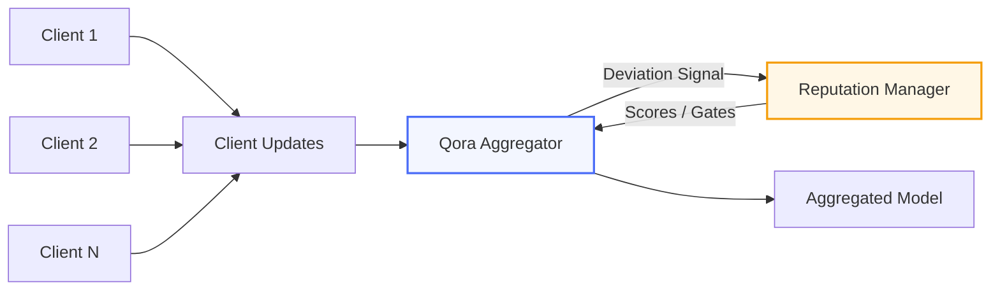

# Qora-FL

**Quorum-Oriented Robust Aggregation for Federated Learning**

[](https://crates.io/crates/qora-fl)
[](https://pypi.org/project/qora-fl/)
[](https://doi.org/10.5281/zenodo.18513738)
[](LICENSE-MIT)

## Problem

Federated learning systems are fragile under adversarial or faulty clients.
Standard aggregation methods silently fail under model poisoning, gradient manipulation, or non-IID drift.

Qora-FL provides Rust-backed robust aggregation methods for federated learning.
Each method has explicit assumptions and tolerance conditions, documented below.
The included experiments evaluate selected attacks with up to 30% adversarial
clients.

> [!IMPORTANT]
> Qora-FL is an experimental robust-aggregation toolkit. Its algorithms are
> implemented and tested, but the project has not received an independent
> security review. Robustness depends on each method's stated assumptions,
> threat model, and correct configuration.

## Currently implemented

Behavior available through tested public paths:

- FedAvg baseline, with optional sample-count weighting
- Coordinate-wise median
- Coordinate-wise trimmed mean
- Krum and Multi-Krum, with their preconditions enforced
- Input validation: dimensions, non-finite rejection, client-ID alignment
- Krum quorum enforcement (`n >= 2f + 3`)
- Multi-Krum selection-bound enforcement (`1 <= m <= n - 2f - 2`)
- Reputation tracking and participation gating
- Optional norm-bound filtering, opt-in and off by default
- Fail-closed behavior when filtering rejects every client
- Reputation numeric invariants (scores finite and within `[0, 1]`)
- Rust API and Python bindings
- Flower-compatible strategy adapter
- Rust CI across three operating systems; Python CI including the adapter

## Experimental or planned

Present in the codebase but **not** wired into the normal aggregation path, or
not yet implemented:

- Reputation-weighted robust aggregation (cubic influence weighting exists as a
  utility only)
- Adaptive or percentile-derived norm bounds (today the caller picks a fixed
  bound)
- Audit records in Python. The Rust API returns a typed, versioned record from
  `aggregate_with_audit`; the bindings do not expose it yet, so that a binding
  design is not frozen while the schema is still experimental.
- Cross-platform bit-identical end-to-end aggregation
- Independent security review
- Real-world deployment validation
- Additional attack and dataset evaluations

## Architecture

```
Clients produce model updates
        │
        ▼
┌───────────────────────────┐
│   Qora Robust Aggregator  │
│                           │
│  ┌─────────────────────┐  │
│  │ Trimmed Mean        │  │
│  │ Median              │  │
│  │ Krum   (n ≥ 2f+3)  │  │
│  │ FedAvg  (baseline)  │  │
│  └─────────────────────┘  │
└─────────────┬─────────────┘
              │
   Deviation signal (not trust)
              │
              ▼
     ┌─────────────────┐
     │    Reputation    │
     │     Manager      │
     │                  │
     │  Scores / Gates  │
     │  / Weighting     │
     └────────┬────────┘
              │
              ▼
     Verified Global Update
```



## Determinism

Qora-FL uses integer arithmetic for Krum distance and score calculations after
BFP-16 encoding (block floating-point, 16-bit mantissas, per-vector shared
exponent). Identical BFP-encoded inputs therefore produce deterministic Krum
scores and rankings.

**Full cross-platform bit-identical aggregation is not currently guaranteed.**
The pipeline is only partly integer:

| Stage | Arithmetic |
|---|---|
| BFP-16 encoding | floating-point (`log2`, scaling, rounding) |
| Krum distances and scores | integer (i32 shifts, i64 accumulation, saturating) |
| Krum result | the selected original `f32` update |
| Multi-Krum result | mean of selected original updates, in `f32` |
| Median, trimmed mean, FedAvg | floating-point throughout |

So the determinism claim covers the scoring stage, not the end-to-end result.
Selection *rankings* are reproducible; the returned values are `f32` and inherit
whatever the encoding and averaging stages do.

## Reputation

Reputation is **not trust**. It is a deviation-derived signal measuring how far
a client's update sits from the aggregate that round.

**What it does today:**

- **Tracks** scores across rounds, persisted via JSON serialization
- **Gates** participation: clients below the configured threshold are excluded
  before aggregation
- **Fails closed**: if every identified client is below the threshold, the round
  returns `AllUpdatesRejected` rather than reinstating them
- **Maintains numeric invariants**: scores are finite and within `[0, 1]`, and
  invalid mutation inputs are rejected rather than clamped

Norm-bound filtering does **not** feed reputation: a client excluded by the
bound is left out of the round and its score is untouched.

**What it does not do yet:** cubic influence weighting (`min(rep^3, 0.8)`) and
its cap are available as utilities, and a caller may use those values directly.
The primary aggregation path does not currently consume them, so the cap does
not provide protection for the default aggregation workflow.
Reputation-weighted robust aggregation is roadmap work.

Details that affect configuration:

- Unknown clients start at the default score of 0.5. A ban threshold above 0.5
  therefore rejects every first-round participant -- which now fails the round
  rather than passing it through ungated.
- Through the Flower adapter, reputation is computed from the complete
  flattened model, and each client receives at most one update per round.
  The adapter performs no gating of its own.

---

## Quick Start (Python + Flower)

Flower is an **optional** extra. The core bindings work without it:
`import qora`, `ByzantineAggregator`, and `ReputationManager` all function with
Flower absent. Only `qora.QoraStrategy` requires it, and importing it without
Flower installed raises an `ImportError` naming the extra to install.

```bash
# Quote the extra: some shells (zsh, fish) treat brackets as globs.
pip install "qora-fl[flower]"
```

Supported range **`flwr>=1.5,<2`**, upper-bounded because the adapter targets
Flower's 1.x strategy interface. **CI tests both ends explicitly: 1.5.0 and
1.32.1.** Versions in between are covered by the declared promise but are not
individually exercised.

```python
import flwr as fl
from qora import QoraStrategy

strategy = QoraStrategy(
    aggregation_method="trimmed_mean",
    trim_fraction=0.2,
    min_fit_clients=5,
    # norm_bound=None by default: no filtering, no norm computation.
)

fl.server.start_server(
    server_address="0.0.0.0:8080",
    config=fl.server.ServerConfig(num_rounds=10),
    strategy=strategy,
)
```

`QoraStrategy` inherits from `FedAvg`, so standard Flower parameters
(`fraction_fit`, `min_fit_clients`, `initial_parameters`, `accept_failures`,
`fit_metrics_aggregation_fn`) are accepted. It is a **compatibility adapter**,
not a behavioral replacement for every Flower built-in strategy.

What the adapter does:

- **One client result becomes one complete Rust update.** Each client's model is
  flattened into a single update, aggregated in one call, then split back into
  the original layer shapes. Aggregating layer by layer would let a selection
  method pick a different client per layer and return a model no client
  submitted.
- **Validates the complete model structure** against the first client as
  reference: layer count, per-layer shape, floating-point dtype, and finiteness.
  A malformed successful result raises `ValueError` naming the client and layer
  rather than being dropped -- discarding it would change the round's effective
  adversarial fraction.
- **Aggregates at `float32`.** `float64` input is accepted and converted; its
  extra precision is not preserved. **Integer parameter arrays are rejected**
  rather than silently coerced into trainable floats.
- **FedAvg weights by `num_examples`.** Robust methods (median, trimmed mean,
  Krum, Multi-Krum) treat each accepted client update as one participant --
  `num_examples` is never reinterpreted as an algorithmic weight there, since an
  attacker claiming a large sample count would otherwise gain proportional
  influence over a median.
- **Honors `accept_failures`.** Reported failures refuse the round when it is
  False, returning `(None, {})` without invoking Rust, moving reputation, or
  calling the metrics callback.
- **Aggregates metrics only through `fit_metrics_aggregation_fn`.** With none
  configured it returns `{}`. Reputation is available through
  `QoraStrategy.get_reputation(client_id)`.
- **Performs no gating of its own.** Reputation gating and updates happen once,
  in the Rust aggregator.
- **Enables norm-bound filtering only when `norm_bound` is passed**, and applies
  it to the complete flattened model rather than to individual layers.

## Python (Standalone)

```bash
pip install qora-fl
```

```python
import numpy as np
from qora import ByzantineAggregator

agg = ByzantineAggregator("trimmed_mean", 0.3)

# 7 honest clients + 3 Byzantine attackers
updates = [np.array([[1.0, 2.0]], dtype=np.float32) for _ in range(7)]
updates += [np.array([[100.0, 200.0]], dtype=np.float32) for _ in range(3)]

result = agg.aggregate(updates)
# Result is [1.0, 2.0] -- attackers rejected
```

### Norm-bound filtering

**Opt-in, and off by default.** Without `norm_bound`, no norm is computed and
behavior is unchanged.

```python
from qora import ByzantineAggregator

agg = ByzantineAggregator("median", 0.0, norm_bound=10.0)
print(agg.norm_bound)   # 10.0, or None when disabled
```

- `None` disables it. A supplied bound must be **finite and strictly
  positive**; zero, negative, NaN, and infinite bounds raise `ValueError`
  rather than being clamped.
- The norm is computed in **`f64`** and compared inclusively -- a norm exactly
  equal to the bound participates.
- A rejected update takes its client ID and its FedAvg sample weight with it, so
  a rejected weight never reaches the numerator or the denominator.
- **A rejected update does not affect reputation.** A large norm is a policy
  violation, not proof of malicious intent; this filter does not claim to detect
  Byzantine behavior.
- If every update is rejected -- by reputation gating, by the bound, or by a
  mixture -- the round raises `ValueError` rather than aggregating a partial or
  best-effort result.
- Method quorum is checked **after** filtering, so filtering can shrink a valid
  cohort into one Krum or Multi-Krum refuses. That is reported, not repaired.

Through the Flower adapter, pass `norm_bound=` to `QoraStrategy`. The bound then
applies to each client's complete flattened model rather than to individual
layers.

### Audit records are Rust-only in 0.4.0

The Rust API returns a typed, versioned `AggregationAuditEntry` from
`aggregate_with_audit`, recording one decision per submitted update with typed
rejection reasons. **The Python bindings do not expose it.** Mirroring the schema
as a hierarchy of Python classes would freeze a binding design while the schema
is still experimental; a later release can return the serialized shape as a
dictionary instead.

What Python does expose is the configuration (`norm_bound`) and the behavior it
produces: an over-bound update is excluded, and a round that rejects everything
raises `ValueError`. The per-client reasons behind that error are not available
from Python yet.

### Reputation Tracking

```python
from qora import ReputationManager

rep = ReputationManager(ban_threshold=0.2)
rep.reward("hospital_A", 0.02)
rep.penalize("hospital_bad", 0.08)

print(rep.is_banned("hospital_bad"))  # True after enough penalties
print(rep.active_clients())           # Only non-banned clients

# Persist between server restarts
json_state = rep.to_json()
rep2 = ReputationManager.from_json(json_state, ban_threshold=0.2)
```

## Rust

```bash
cargo add qora-fl
```

```rust
use qora_fl::{ByzantineAggregator, AggregationMethod};
use ndarray::array;

let mut agg = ByzantineAggregator::new(AggregationMethod::TrimmedMean, 0.3);

let updates = vec![
    array![[1.0, 2.0]],   // Honest
    array![[1.1, 2.1]],   // Honest
    array![[0.9, 1.9]],   // Honest
    array![[100.0, 200.0]], // Byzantine attacker
];

let result = agg.aggregate(&updates, None).unwrap();
// Result is close to [1.0, 2.0], attacker ignored
```

### Individual Functions

```rust
use qora_fl::{trimmed_mean, median, fedavg};
use ndarray::array;

let updates = vec![array![[1.0]], array![[2.0]], array![[3.0]]];

let tm = trimmed_mean(&updates, 0.2).unwrap();
let med = median(&updates).unwrap();
let avg = fedavg(&updates, None).unwrap();
```

## Aggregation methods and their assumptions

`n` is the number of accepted client updates; `f` is the configured Byzantine
bound; `m` is the number of Multi-Krum candidates selected.

| Method | Enforced precondition | Assumption for robustness |
|---|---|---|
| `TrimmedMean` | `0.0 <= trim_fraction <= 0.5`, and at least one value must survive trimming | Depends on trim fraction, adversarial proportion, attack model, and the distribution of honest updates |
| `Median` | none beyond shared input validation | Strictly fewer than 50% adversarial values **per coordinate** |
| `Krum` | `n >= 2f + 3` | Blanchard et al. (2017) |
| `MultiKrum` | `n >= 2f + 3` and `1 <= m <= n - 2f - 2` | Blanchard et al. (2017) |
| `FedAvg` | weights, when supplied, must be finite and non-negative with a positive total | **None.** Conventional sample-weighted baseline; provides no Byzantine robustness by itself |

**Trimmed mean** removes the configured fraction of the smallest and largest
values independently in each coordinate. A trim fraction is *not* an attacker
percentage: `trim_fraction = 0.2` does not establish tolerance of 30% malicious
clients, and no such universal guarantee is claimed here.

**Median** requires an honest majority per coordinate. Exactly 50% adversarial
is not strictly fewer than half, so "tolerates 50%" would be wrong.

**Krum** rejects configurations violating `n >= 2f + 3` with
`InsufficientQuorum`. There is no best-effort path below quorum.

**Multi-Krum** rejects an explicit `m` outside `1..=n - 2f - 2` with
`InvalidMultiKrumSelection`. When `m` is omitted, Qora-FL uses
`min(3, n - 2f - 2)`; explicit unsafe values are rejected rather than silently
reduced.


## Experiments

Qora-FL includes an attack-evaluation script for comparing aggregation methods
across selected attacks and adversarial-client fractions. The repository does
not currently publish verified benchmark results from a pinned dataset artifact
and repeated multi-seed evaluation. Run the included experiment to evaluate the
methods in your own environment.

See the [root README](https://github.com/CavinKrenik/qora-fl#experiments) for
the full configuration and its limitations.

```bash
# Aggregation overhead (Python)
python examples/benchmark_overhead.py

# MNIST poisoning: FedAvg vs Qora-FL under 30% attack
pip install matplotlib scikit-learn
python examples/mnist_poisoning_demo.py

# Criterion benchmarks (Rust)
cargo bench
```

```bash
# Rust examples
cargo run --example quickstart
cargo run --example compare_methods
```

## Validation status

Qora-FL is currently validated through:

- the Rust unit and integration test suite
- Python binding and Flower adapter tests
- cross-platform Rust CI (Linux, macOS, Windows) and Python CI
- Flower compatibility tests at both ends of the supported version range
- algorithm preconditions enforced in code and covered by tests
- the included examples and benchmarks, under their documented configurations

This is engineering validation. It is **not** an independent security review,
and it does not establish robustness outside each algorithm's stated
assumptions. See [SECURITY.md](SECURITY.md) for the boundaries.

## Background

The aggregation algorithms in Qora-FL (trimmed mean, coordinate-wise median,
Krum, Multi-Krum) are standard Byzantine-robust methods from the federated
learning literature [1][2].

## Project history

Qora-FL grew out of aggregation and distributed-trust experiments explored in
the earlier QRES project ([CavinKrenik/QRES_RaaS](https://github.com/CavinKrenik/QRES_RaaS),
historical work). Design choices here -- deviation-derived reputation, the
BFP-16 scoring path, adaptive trim fraction, and the influence cap -- were
informed by those earlier experiments and long-horizon simulations.

Qora-FL is a separate implementation with its own tests, experiments, and
assumptions. Results or guarantees from QRES do not automatically apply to
Qora-FL, and none of the evidence in this repository is inherited from it.

## Design Philosophy

Qora-FL treats aggregation as a **decision process**, not a statistical convenience. The system favors explicit constraints, observable signals, and predictable failure modes over opaque optimization.

## Roadmap

- Weighted robust aggregation (reputation-scaled trimmed mean)
- Adaptive trim selection based on detected attack intensity
- TensorFlow Federated adapter
- Formal verification experiments for the integer scoring path

## License

Licensed under either of [Apache License, Version 2.0](LICENSE-APACHE) or [MIT License](LICENSE-MIT) at your option.
